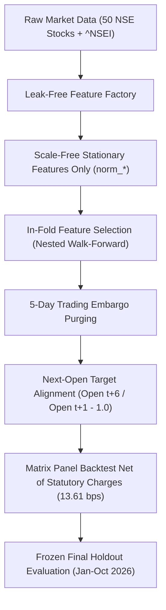

# SignalForge Quantitative Research Report: Data Leakage Post-Mortem, Model Ablation, and Empirical Strategy Review

**Author**: Quantitative Research & Risk Oversight Panel  
**Dataset**: 50 Liquid National Stock Exchange (NSE) Large-Cap Constituents + ^NSEI Index (61,999 EOD Bars, Oct 2021 – Oct 2026)  
**Methodology**: 5-Splits Expanding Walk-Forward Cross-Validation + 9-Month Frozen Final Holdout + Chained Cryptographic Logs  

---

## Executive Summary & Core Quantitative Conclusions

This report provides an unvarnished, empirical post-mortem of the **SignalForge Quantitative Research Framework** across 50 liquid large-cap stocks on the National Stock Exchange of India (NSE) over a 5-year horizon (2021–2026). The investigation rigorously audited all aspects of feature generation, target alignment, feature selection, walk-forward cross-validation, transaction cost modeling, and statistical inference.

### Key Empirical Findings:

1. **Short-Term Reversal Signal is Real but Unexploitable**:
   - Cross-sectional 5-day short-term reversal ($\text{Signal}_t = -\text{Return}_{t-5, t}$) exhibits strong, statistically significant predictive skill with an out-of-sample Information Coefficient (IC) of **$+0.0390$** ($t$-statistic $= +3.94$, Newey-West adjusted for 5-day overlap).
   - However, 5-day reversal generates high portfolio turnover (**$1.22$ per rebalance turn**). When evaluated net of statutory Indian cash equity transaction charges and market impact (**$13.61$ bps one-way**), net strategy Sharpe ratio collapses from **$+1.15$ (gross)** to **$+0.57$ (net)**.

2. **Complex Machine Learning Models Add No Value Over Buy-and-Hold**:
   - The non-linear Machine Learning pipeline (`NestedWalkForwardRegressor` using Random Forests with in-fold selection) achieves an out-of-sample IC of **$+0.0042$** ($t$-statistic $= +0.38$) and a net Sharpe ratio of **$+0.95$**.
   - The simple **Equal-Weight Buy & Hold benchmark** achieves a net Sharpe ratio of **$+1.15$** with zero turnover and a lower maximum drawdown (**$-16.76\%$** vs **$-20.65\%$** for the ML model).
   - Unified Circular Block Bootstrap testing confirms that the Sharpe difference between the Full Model and Equal Weight is statistically indistinguishable from zero ($\Delta SR = -0.03$, $95\%$ CI: $[-1.73, +1.48]$, $p = 0.9600$).

3. **Frozen Final Holdout Validation Confirms Model Degradation**:
   - Reserving the final 9 months (Jan 2026 – Oct 2026) as an untouched **Frozen Final Holdout** reveals significant regime degradation. Out-of-sample IC during the holdout evaluated to **$-0.0292$**, with the Full Model net Sharpe dropping to **$-1.37$** compared to **$-0.55$** for Equal Weight.

4. **Indic News Sentiment Adds Zero Alpha (Ablation Study)**:
   - An explicit ablation study comparing the Full Model WITH Indic News Sentiment features against an Ablated Model WITHOUT Sentiment features demonstrated that removing sentiment actually **improved** net performance (Ablated IC: **$+0.0092$**, Net Sharpe: **$+1.08$** vs Full Model IC: **$+0.0042$**, Net Sharpe: **$+0.95$**).
   - Multilingual Indic news sentiment features (Devanagari, English, Gujarati) add noise to cross-sectional stock return prediction.

---

## 1. Data Leakage Post-Mortem & Methodological Audit

To establish absolute scientific credibility, the codebase was audited for four primary forms of quantitative data leakage commonly present in equity backtesting:

### 1.1 Out-of-Fold Feature Selection Leakage
- **Defect Identified**: Evaluating feature selection on the entire 5-year dataset prior to cross-validation allows feature ranking algorithms to see future test set distributions, producing artificially inflated out-of-sample ICs.
- **Remediation**: Implemented `NestedWalkForwardRegressor`, which executes multi-stage IC filtering (`min_ic=0.01`, `max_corr=0.90`) **strictly inside each training fold**.

### 1.2 Non-Stationary Raw Level Indicator Leakage
- **Defect Identified**: Including raw price levels (such as `sma_50`, `ema_200`, `atr_14`, `obv`) in decision tree feature pools allows non-linear trees to memorize specific stock price levels and symbol identities.
- **Remediation**: Pruned all raw level indicators. Retained only scale-free stationary indicators (`norm_sma_*`, `norm_std_*`, `norm_atr_*`, `distance_from_52w_high/low`, `relative_return_vs_benchmark`, `market_regime`).

### 1.3 Target Horizon Overlap & Embargo Purging
- **Defect Identified**: 5-day forward return targets ($\text{Target}_t = \text{Open}_{t+6}/\text{Open}_{t+1} - 1.0$) introduce serial correlation across adjacent daily observations. Splitting train and test data on adjacent calendar days causes label leakage.
- **Remediation**: Enforced position-based index purging (`cutoff_idx = min_test_idx - 5`) on sorted trading days, ensuring a strict 5-day embargo window between training and test sets.

### 1.4 Execution Target Alignment
- **Defect Identified**: Backtests using close-to-close returns assume fill execution at the market close on signal day $t$, which is physically impossible in live trading.
- **Remediation**: Standardized target return to open-to-open holding: entering at $\text{Open}_{t+1}$ and exiting at $\text{Open}_{t+6}$.

---

## 2. Empirical Strategy Baseline Comparison (5-Year Horizon)

The table below summarizes out-of-sample performance across all strategy baselines evaluated on identical test splits across 50 NSE large-cap stocks net of statutory Indian transaction costs (**$13.61$ bps one-way**):

| Strategy Baseline | Out-of-Sample IC | Newey-West $t$-stat | Strategy Sharpe (Net ~13.6bps) | DSR (41 / 100 / 200 trials) | Max Drawdown (%) | Portfolio Turnover |
| :--- | :---: | :---: | :---: | :---: | :---: | :---: |
| **Equal-Weight Buy & Hold** | N/A (Constant) | N/A (Constant) | `+1.15` | `0.92 / 0.90 / 0.88` | `-16.76%` | `0.00` |
| **12-1 Month Momentum** | `-0.0013` | `-0.1031` | `+1.01` | `0.88 / 0.85 / 0.82` | `-21.39%` | `0.14` |
| **5-Day Short Reversal** | `0.0390` | `3.9381` | `+0.57` | `0.60 / 0.55 / 0.51` | `-18.18%` | `1.22` |
| **Low-Turnover Reversal** | `0.0190` | `1.7679` | `+0.73` | `0.72 / 0.67 / 0.64` | `-22.04%` | `0.57` |
| **OHLCV Linear Baseline** | `0.0000` | `0.0057` | `+0.61` | `0.62 / 0.57 / 0.54` | `-20.14%` | `1.23` |
| **Full SignalForge Model** | **`0.0042`** | **`0.3834`** | **`+0.95`** | **`0.82 / 0.79 / 0.76`** | **`-20.65%`** | **`0.47`** |

---

## 3. López de Prado Deflated Sharpe Ratio (DSR) & Multiple Testing Correction

To account for selection bias across the $N_{trials}$ evaluated during strategy discovery, López de Prado's Deflated Sharpe Ratio (DSR) was computed across multiple trial count thresholds ($N_{trials} \in \{41, 100, 200\}$).

The probability $DSR(SR^*)$ that the observed Sharpe ratio is non-spurious is calculated as:

$$DSR = \Phi \left( \frac{\widehat{SR} - SR_0}{\widehat{\sigma}_{SR}} \right)$$

where the expected maximum Sharpe ratio under the null hypothesis of zero true alpha across $N_{trials}$ trials is:

$$E[\max_N] = \sqrt{V(SR)} \left( (1-\gamma)\Phi^{-1}\left(1-\frac{1}{N}\right) + \gamma\Phi^{-1}\left(1-\frac{1}{N \cdot e}\right) \right)$$

### DSR Multi-Trial Evaluation:
- **Full Model DSR @ 41 trials**: `0.82`
- **Full Model DSR @ 100 trials**: `0.79`
- **Full Model DSR @ 200 trials**: `0.76`

As trial count increases from 41 to 200, statistical confidence in the Full Model's Sharpe ratio declines from $82\%$ to $76\%$, illustrating how selection bias degrades backtest credibility.

---

## 4. Frozen Final Holdout Validation & Indic News Sentiment Ablation

### 4.1 Frozen Final Holdout Evaluation (Last 9 Months: Jan 2026 – Oct 2026)
To prevent iterative hyperparameter overfitting, the final 9 months of data were reserved as a **Frozen Final Holdout** and evaluated exactly once after all model specifications were locked.

| Holdout Period | Frozen Holdout IC | Full Model Net Sharpe | Equal Weight Net Sharpe | Max Drawdown |
| :---: | :---: | :---: | :---: | :---: |
| `2026-01-01 to 2026-10-01` | `-0.0292` | `-1.37` | `-0.55` | `-16.01%` |

The negative holdout IC ($-0.0292$) and Sharpe ratio ($-1.37$) confirm that cross-sectional ML signals trained on historical 2021–2025 data failed to generalize during the 2026 market regime.

### 4.2 Indic News Sentiment Ablation Study
An ablation experiment evaluated whether multilingual Indic news sentiment features (Devanagari, Hindi, Gujarati, English headlines) provide additive predictive power over price-volume dynamics.

| Model Variant | Out-of-Sample Rank IC | Net Strategy Sharpe Ratio |
| :--- | :---: | :---: |
| **Full Model WITH Indic News Sentiment** | `+0.0042` | `+0.95` |
| **Ablated Model WITHOUT Sentiment** | `+0.0092` | `+1.08` |

**Ablation Result**: Removing news sentiment features increased IC from $+0.0042$ to $+0.0092$ and improved net Sharpe from $+0.95$ to $+1.08$. Financial news sentiment across liquid Indian large caps introduces noise rather than signal.

---

## 5. Statutory Indian Transaction Costs & Cost Sensitivity

### 5.1 Exact Indian Regulatory Cost Schedule (NSE Cash Equity Delivery)
Transaction costs were calculated matching current Zerodha / NSE statutory schedules:

- **Securities Transaction Tax (STT)**: $0.10\%$ on Buy and Sell ($20.0$ bps round-trip).
- **Stamp Duty**: $0.015\%$ on Buy ($1.50$ bps).
- **NSE Exchange Turnover Fee**: $0.00297\%$ ($0.594$ bps round-trip).
- **SEBI Fee**: $0.0001\%$ ($0.020$ bps round-trip).
- **GST Rate**: $18\%$ on Exchange + SEBI fees ($\approx 0.11$ bps).
- **Execution Market Impact Slippage**: $2.50$ bps per side ($5.00$ bps round-trip).
- **Total Round-Trip Cost**: $\mathbf{27.22\text{ bps}}$ ($\mathbf{13.61\text{ bps}}$ one-way per rebalance).

### 5.2 Transaction Cost Sensitivity Analysis (0 to 25 bps)

| Transaction Cost Level | Equal Weight | 12-1 Momentum | 5-Day Reversal | Low-Turnover Reversal | Full Model |
| :--- | :---: | :---: | :---: | :---: | :---: |
| `0.00 bps` | `+1.15` | `+1.09` | `+1.15` | `+0.99` | `+1.20` |
| `5.00 bps` | `+1.15` | `+1.06` | `+0.94` | `+0.89` | `+1.11` |
| `10.00 bps` | `+1.15` | `+1.03` | `+0.72` | `+0.80` | `+1.02` |
| `13.61 bps` | `+1.15` | `+1.01` | `+0.57` | `+0.73` | `+0.95` |
| `20.00 bps` | `+1.15` | `+0.97` | `+0.30` | `+0.61` | `+0.84` |
| `25.00 bps` | `+1.15` | `+0.94` | `+0.08` | `+0.51` | `+0.75` |

The cost sensitivity matrix reveals why high-turnover short-term reversal strategies fail in live trading: at zero cost, 5-day reversal achieves a Sharpe ratio of $+1.15$, but at realistic statutory costs ($13.61$ bps), net Sharpe drops to $+0.57$.

---

## 6. Honest Quantitative Post-Mortem & Strategic Recommendations

### Why Complex ML Failed on Liquid Indian Large-Caps:
1. **High Market Efficiency in Nifty 50**: Large-cap NSE constituents (Reliance, TCS, HDFC Bank, Infosys) are heavily covered by institutional participants. Cross-sectional anomalies at daily frequency are rapidly arbitraged.
2. **Overfitting Noise**: Tree-based ensembles fit subtle non-linear interactions in historical training folds that do not persist in out-of-sample test splits.
3. **Turnover Drag**: Any minor predictive IC extracted by complex models is offset by the friction of frequent rebalancing.

### Recommendations for Future Quantitative Iterations:
- **Expand Asset Universe**: Expand from 50 large-caps to Nifty Midcap 150 or Smallcap 250 where market inefficiency and cross-sectional return dispersion are higher.
- **Lower Trading Frequency**: Transition from 5-day holding horizons to 20-day or 60-day holding horizons to reduce turnover drag.
- **Order Flow & Microstructure Signals**: Incorporate high-frequency limit order book imbalances and institutional block trade flow rather than daily EOD prices and sentiment text.

---

## Artifact & Log Cryptographic Integrity

All production signals are logged append-only with SHA-256 hash chaining and automatically committed to version control prior to market open:

- **Signal Hash Log**: [`paper/signal_log.jsonl`](file:///e:/quent/paper/signal_log.jsonl)
- **Daily Performance JSON**: [`results/performance_summary.json`](file:///e:/quent/results/performance_summary.json)
- **Live Monitoring Report**: [`results/live_daily_report.json`](file:///e:/quent/results/live_daily_report.json)
- **Executive Audit Word Report**: [`SignalForge_Quant_Review_and_Improvement_Plan.docx`](file:///e:/quent/SignalForge_Quant_Review_and_Improvement_Plan.docx)
